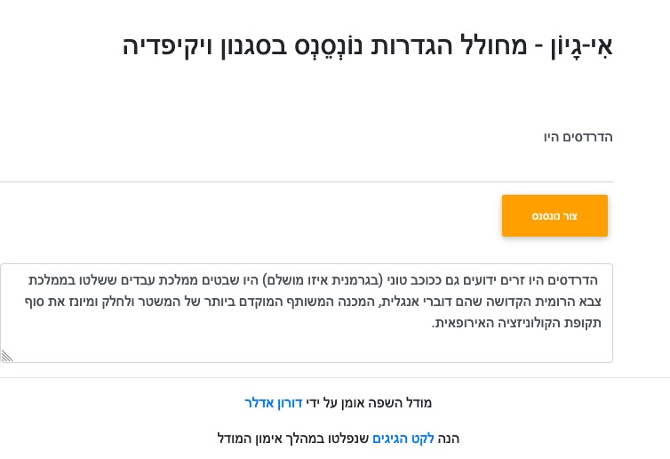

<h2 dir="rtl" class="my-5 mx-lg-5">
            <strong>אִי-גָיוֹן   מחולל הגדרות נוֹנְסֵנְס בסגנון ויקיפדיה</strong>
        </h2>
        

 מחולל ג'יבריש שנראה כמו ערכים בויקיפדיה. מבוסס על מודל הבינה המלאכותית דיסטיל-ג׳יפיטי2 שאומן על תקצירים מויקיפדיה העברית.     <a href="https://e-gayon.com/">https://e-gayon.com </a>

 

הנה  <a href="https://e-gayon.com/leket.html">לקט הגיגים </a> שנפלטו במהלך אימון המודל 

## Building from source

To get started on this project, follow these steps:

* Clone: `git clone https://github.com/Norod/gpt2-hewiki.git` and `cd gpt2-hewiki`
* _Optional_: checkout a _Release_ tag, e.g. `git checkout v1.0.2`
* Install Dependencies: `pip install -r requirements.txt`
* Run `download.sh` to download and extract the trained GPT-2 model
* Run server: `python main.py`
* Open Web Browser and visit: `http://localhost:8080/`
* Type `שלום עולם` and press on `צור נונסנס` (or hit Enter)
* Enjoy!

You may also want to build and run this project in docker container

* Build: `docker build -t gpt2-hewiki .` (will take some time)
* Run: `docker run -p 8080:8080 --rm -d gpt2-hewiki`

If successful, you will see something like this:

## More information

This repository is based upon the code and knowlege found in the following Medium tutorial: [Deploy Machine Learning Model in Google Cloud using Cloud Run](https://medium.com/@NaxAlpha/deploy-machine-learning-model-in-google-cloud-using-cloud-run-6ced8ba52aac)
